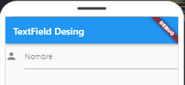
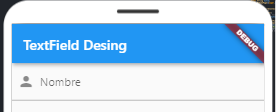
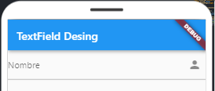
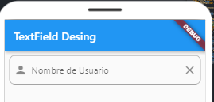

# Cómo añadir iconos dentro de un campo de texto en Flutter (TextField)

>Este artículo se inspiró en el trabajo original de [Mohammed Rashid](https://codingwithrashid.com/how-to-add-icon-inside-textfield-in-flutter/). He realizado mejoras y ajustes para adaptarlo a nuestras necesidades, pero queremos reconocer y agradecer la fuente de inspiración inicial.

El `TextField` es un elemento fundamental en Flutter, desempeñando un papel crucial en la interacción con los usuarios. Incorporar un ícono en su interior puede facilitar a los usuarios la identificación del contenido que deben introducir. Vamos a explorar cómo añadir un ícono dentro de este componente en Flutter.

La clase `InputDecoration` se convierte en una aliada valiosa para dar estilo al TextField. Su propiedad icon posibilita la adición de un ícono que se integra armoniosamente en el TextField.

A continuación veamos unos ejemplos y la diferencia de usar:
- icon
- prefixIcon
- suffixIcon 

### 1. `icon` en InputDecoration:

La propiedad icon en InputDecoration te permite agregar un icono fijo al principio del TextField. Este icono no se puede modificar ni desplazar.

Ejemplo:
```dart
TextField(
  decoration: InputDecoration(
    icon: Icon(Icons.person),
    labelText: 'Nombre',
  ),
)
```


### 2. `prefixIcon` en InputDecoration:

La propiedad prefixIcon te permite colocar un icono al principio del TextField, pero a diferencia de icon, este icono puede modificarse y desplazarse.

Ejemplo:
```dart
TextField(
  decoration: InputDecoration(
    prefixIcon : Icon(Icons.mail),
    labelText: 'Correo electrónico',
  ),
)
```


### 3. `suffixIcon` en InputDecoration:

La propiedad suffixIcon te permite agregar un icono al final del TextField. Este icono también puede modificarse y desplazarse.

Ejemplo:
```dart
TextField(
  decoration: InputDecoration(
    suffixIcon: Icon(Icons.visibility),
    labelText: 'Contraseña',
  ),
)
```


##### 🎨¡Echa un vistazo al siguiente código y descubre cómo puedes llevar 🚀 tus TextField en Flutter al siguiente nivel! En este ejemplo, hemos combinado varias propiedades para lograr un diseño elegante y atractivo:

```dart
TextField(
  decoration: InputDecoration(
    labelText: 'Nombre de Usuario',
    hintText: 'Ingresa tu nombre de usuario',
    prefixIcon: Icon(Icons.person),
    suffixIcon: IconButton(
      icon: Icon(Icons.clear),
      onPressed: () {
        // Lógica para borrar el contenido del TextField
      },
    ),
    enabledBorder: OutlineInputBorder(
      borderSide: BorderSide(color: Colors.grey),
      borderRadius: BorderRadius.circular(10.0),
    ),
    focusedBorder: OutlineInputBorder(
      borderSide: BorderSide(color: Colors.blue),
      borderRadius: BorderRadius.circular(10.0),
    ),
    errorBorder: OutlineInputBorder(
      borderSide: BorderSide(color: Colors.red),
      borderRadius: BorderRadius.circular(10.0),
    ),
    focusedErrorBorder: OutlineInputBorder(
      borderSide: BorderSide(color: Colors.red),
      borderRadius: BorderRadius.circular(10.0),
    ),
    // Otras propiedades personalizadas según sea necesario
  ),
)
```


En este ejemplo usamos las propiedades:

- labelText proporciona una etiqueta para el campo.
- hintText muestra un texto de sugerencia cuando el campo está vacío.
- prefixIcon agrega un icono al principio del TextField.
- suffixIcon coloca un icono al final del TextField.
- enabledBorder y focusedBorder establecen los bordes para el estado normal y enfocado, respectivamente.
- errorBorder y focusedErrorBorder establecen los bordes cuando hay un error.

¡Espero esta guía les resulte útil e interesante!

## ¡Gracias por llegar hasta aquí, por favor! 🎁
- Comenta a otros sobre este proyecto 📢
- Invítame una cerveza 🍺 o un café ☕
- Regalame un estrella al repo ⭐
- etc.

<p>
<a href="https://github.com/kristiancdev" target="_blank"></a><a href="https://www.instagram.com/kristiancdev/" target="_blank"></a> <a href="https://www.tiktok.com/@kristiancdev" target="_blank"></a>
  <a href="https://www.linkedin.com/in/cristiancevallos" target="_blank"></a>
</p>

[](https://www.buymeacoffee.com/kristiancdev)
